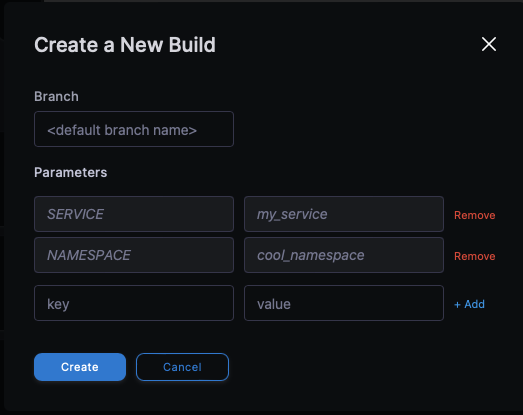

# TemplateNexus
TemplateNexus is a lightweight development toolkit that simplifies project bootstrapping by providing ready-to-use templates with common dependencies and infrastructure configurations.

## Features
- Pre-configured project templates with essential libraries
- Local development environments using Docker (MongoDB/PostgreSQL)
- Database migration support
- Docker build pipeline configurations
- Kubernetes deployment templates and secret management (seeding with secrets)

## How it works

The deployment pipeline is straightforward and can be initiated through the Drone UI. When launching the job, you'll need to provide:
- Service name
- Target namespace for the service

### Pipeline Steps

#### 1. Repository Clone
Clones the TemplateNexus repository and executes the [.drone.yml](.drone.yml) configuration file.

#### 2. GitHub Repository Creation
Creates a new GitHub repository using the provided service name as the repository name.
More details on GitHub repository setup can be found [here](docs/gh_setup.md).

#### 3. Template Generation
Runs the cookiecutter pipeline to generate all the necessary code and configurations, customized for your service:
- Application code structure
- Kubernetes manifests
- Database configurations
- CI/CD pipelines

More details on the cookiecutter template can be found [here](docs/cookiecutter.md).

#### 4. Code Commit
Commits and pushes the generated codebase to the newly created GitHub repository, establishing the foundation for your service.

