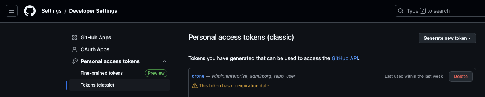

# GitHub Personal Access Token Setup

To create a GitHub repository via the pipeline, you'll need to generate a Personal Access Token (PAT) with appropriate permissions.

## Steps to Generate Token

1. Go to GitHub Settings
2. Navigate to "Developer settings" in the left sidebar
3. Select "Personal access tokens" -> "Tokens (classic)"
4. Click "Generate new token (classic)"
5. Configure token:
   - Give it a descriptive name
   - Select all permissions under:
     - repo (Full control)
     - workflow
     - admin:org
     - delete_repo
   - Set an expiration date
6. Click "Generate token"
7. **Important**: Copy and save the token immediately as it won't be shown again

**Note**: Keep this token secure and never commit it to version control. The token should be stored as a secure secret in your CI/CD system.
