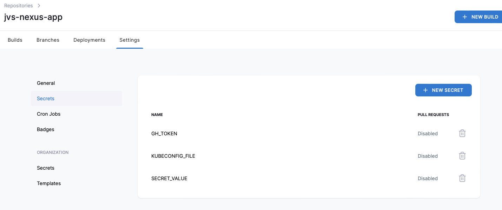
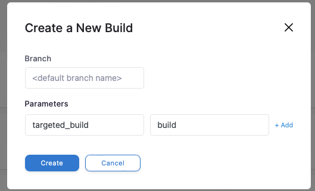
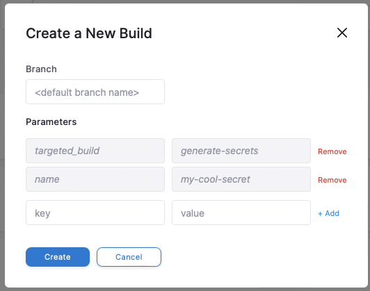

# {{ cookiecutter.project_slug }}

This is a Flask application template configured with Drone CI/CD for automated building and deployment.

## CI/CD Workflows

The project uses Drone CI/CD with the following pipeline steps:

### 1. Build Step (`{{ cookiecutter.project_slug }}-build`)
- Builds a Docker container for the application
- Uses Docker-in-Docker (DinD) for container building
- Tags the image as `{{ cookiecutter.project_slug }}:latest`

### 2. Secret Generation Step (`generate-secrets`)
- Triggered only when `targeted_build=generate-secrets`
- Creates and manages Kubernetes secrets
- Pushes secret configuration to the repository
- Applies secrets to the Kubernetes cluster

## Required Drone Secrets

The following secrets need to be configured in your Drone CI settings:

| Secret Name | Description |
|------------|-------------|
| `GH_TOKEN` | GitHub token for repository access |
| `SECRET_VALUE` | The secret value to be stored in Kubernetes |
| `KUBECONFIG_FILE` | Kubernetes configuration file for cluster access |



## Environment

- Kubernetes Namespace: `{{ cookiecutter.kubernetes_namespace }}`

## Usage

### Regular Build
The default pipeline will build the Docker image. Hit build without any parameters or:



### Generating Secrets
To generate and apply secrets:

1. Trigger the pipeline with parameter `targeted_build=generate-secrets`
2. This will:
   - Create a secret configuration file
   - Push it to the repository
   - Apply the secret to Kubernetes



Generates a secret in the namespace `{{ cookiecutter.kubernetes_namespace }}` named my-cool-secret.

How to load in kubernetes yaml env:

```yaml
env:
- name: MY_SECRET
  valueFrom:
    secretKeyRef:
      name: my-cool-secret
      key: secret
```

### Setting Up Local Databases

To spin up databases locally, use Docker Compose or a similar tool. Ensure your application is configured to connect to these local instances. 

#### Example with Docker Compose

1. Create a `docker-compose.yml` file in your project folder with the following content:

   ```yaml
   version: '3.1'

   services:
     db:
       image: postgres:latest
       environment:
         POSTGRES_USER: myuser
         POSTGRES_PASSWORD: mypassword
         POSTGRES_DB: mydatabase
       ports:
         - "5432:5432"
   ```

2. Run the following command to start the database:

   ```bash
   docker-compose up -d
   ```

3. Connect your application using the following credentials:
   - **Host:** `localhost`
   - **Port:** `5432`
   - **Database:** `mydatabase`
   - **User:** `myuser`
   - **Password:** `mypassword`

